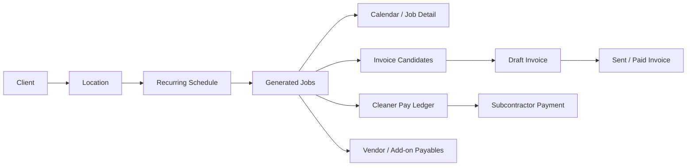
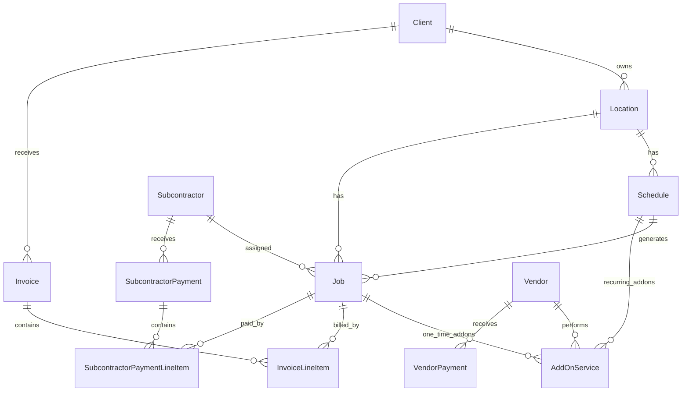
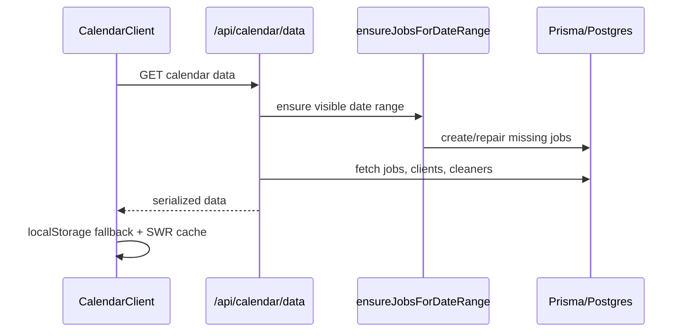

# Clean Freaks App - Developer Handoff

Last updated: 2026-06-19

This document is the engineering handoff for the Clean Freaks internal operations app. It is intentionally product-aware as well as code-aware: future developers need to understand the cleaning business workflow, the data lifecycle, and the places where this app has accumulated multiple implementation generations.

The app was built quickly and iteratively. Some older components and routes still exist beside newer replacements. Treat this document as the current map of the system and the rules that must stay consistent as the app scales.

> **Cleanup note (2026-06-19):** the standalone `/subcontractors` and `/vendors` pages and their page-only components were removed after being consolidated into `/payables` (the single home for cleaner + vendor payment tracking, profiles, and history). The now-orphaned routes `GET /api/subcontractors/data`, `POST /api/subcontractors/[id]/unmark-all-paid`, and `DELETE /api/subcontractors/[id]/payments/[paymentId]` were deleted with them. The remaining `/api/subcontractors/*` and `/api/vendors/*` routes are still in use by `/payables` and shared forms — do not remove them.

## 1. What The App Does

Clean Freaks uses this app to run a commercial cleaning operation:

- Track clients, locations, contacts, access instructions, notes, start dates, and recurring schedules.
- Generate and manage calendar jobs from recurring schedules.
- Edit individual cleans or apply recurring schedule changes going forward.
- Track cleaners/subcontractors, vendor add-ons, payables, and payment history.
- Generate invoice candidates from scheduled/completed jobs.
- Review, draft, send, and mark invoices paid.
- Compare operational data against the client source-of-truth spreadsheet.

The core operational loop is:



## 2. Stack And Runtime

### Main Stack

- Next.js 14 App Router
- React 18
- TypeScript
- Prisma 5
- PostgreSQL, currently Supabase in production
- SWR for client-side fetching/cache
- Tailwind CSS
- Radix UI primitives
- Lucide icons
- `@react-pdf/renderer` for invoice PDFs
- Nodemailer / Resend support for email sending
- Zod for validation
- Vitest for tests

### Important Commands

```bash
npm run dev
npm run build
npm run start
npm run test
npm run lint
npm run prisma:generate
npm run prisma:migrate
npm run prisma:studio
npm run create-admin
```

`npm run build` runs `prisma generate && next build`.

### Local Repo Path During This Handoff

The current working copy used for this handoff is:

```text
E:\downloaddddss\may2026\josh\clean-freaks-app
```

Do not bake this local path into code. It is only useful for knowing which checkout this document was written against.

## 3. Environment Variables

Do not commit `.env` or `.env.local`.

Required or commonly used variables:

| Variable | Purpose |
| --- | --- |
| `DATABASE_URL` | Prisma PostgreSQL connection string. Use the pooled Supabase URL in serverless production. |
| `SESSION_SECRET` | Signs the custom auth cookie. Must be stable and secret. |
| `NEXT_PUBLIC_BASE_URL` / app URL values | Public app base URL for invoice links and callbacks. |
| `CRON_SECRET` | Used by cron endpoints when protected. |
| Gmail / SMTP / Resend values | Some email settings are env-backed, but the app also stores email settings in the database. See Settings and `EmailSettings`. |

The app also has `lib/env-validation.ts`. That file checks several email/SMTP variables. The current product flow also uses database-backed email settings, so treat env validation as a safety net, not the full email source of truth.

## 4. Deployment And Scheduled Jobs

Vercel config lives in `vercel.json`.

Current cron jobs:

```json
[
  { "path": "/api/jobs/auto-complete", "schedule": "0 5 * * *" },
  { "path": "/api/jobs/auto-generate", "schedule": "0 6 * * *" },
  { "path": "/api/cron/send-scheduled", "schedule": "0 * * * *" }
]
```

Meaning:

- `auto-complete`: marks past scheduled jobs complete or otherwise advances completion assumptions.
- `auto-generate`: ensures future jobs exist from recurring schedules.
- `send-scheduled`: sends invoices scheduled for later.

Serverless caveat: Vercel functions do not run persistent background workers. If something must happen reliably in production, put it in an API route called by the UI or a Vercel Cron route. Do not rely on `setInterval`, dev server startup behavior, or long-running background state.

## 5. Directory Map

```text
app/
  api/                  Next route handlers. Most business mutations live here.
  calendar/             Calendar page shell.
  clients/              Client list, new client, and client detail pages.
  invoices/             Current invoicing workspace and classic invoice page.
  payables/             Consolidated cleaners + vendors workspace (payment tracking, profiles, history).
  settings/             Email/settings UI.

components/
  calendar/             Calendar UI, job detail dialog, job mutations.
  clients/              Client list/detail, forms, schedule/location UI.
  dashboard/            Dashboard cards/lists.
  invoices/             Invoice workspace, classic invoice UI, PDF components.
  payables/             Consolidated cleaner + vendor payables UI.
  ui/                   Shared UI primitives.

lib/
  auth.ts               Custom cookie auth.
  db.ts                 Prisma singleton.
  regenerate-schedule-jobs.ts
  invoice-calculations.ts
  invoice-status.ts
  payout-calculator.ts
  payment-cadence.ts
  schedule-projection.ts
  schedule-timing.ts
  date-only.ts
  email.ts
  ...

prisma/
  schema.prisma         Database schema.

scripts/
  sync-source-of-truth.ts
  fix-data-accuracy.ts
  fix-claude-checklist.ts
  backfill-vendors.ts
  backfill-schedule-pay-type.ts
  create-admin-user.ts

docs/
  v1.3-testing-checklist.md
  DEVELOPER_HANDOFF.md
```

## 6. Current Primary UI Entry Points

Some old components are still in the repository. These are the currently relevant page paths:

| Route | Page file | Primary component | Notes |
| --- | --- | --- | --- |
| `/` | `app/page.tsx` | `components/dashboard/dashboard-client.tsx` | Dashboard fetches client overview/stats client-side. |
| `/calendar` | `app/calendar/page.tsx` | `components/calendar/calendar-client.tsx` -> `CalendarView` | Uses SWR and localStorage fallback cache. |
| `/clients` | `app/clients/page.tsx` | `components/clients/clients-client.tsx` / page wrapper | Client list and add-client entry. |
| `/clients/[id]` | `app/clients/[id]/page.tsx` | `components/clients/client-detail-client.tsx` | Client profile/cockpit/detail experience. |
| `/invoices` | `app/invoices/page.tsx` | `components/invoices/workspace/invoicing-workspace.tsx` | Current redesigned invoice workspace. |
| `/invoices/classic` | `app/invoices/classic/page.tsx` | Classic invoice UI | Kept during rollout. Do not assume it is primary. |
| `/payables` | `app/payables/page.tsx` | `components/payables/payables-workspace.tsx` | **Single consolidated home for cleaners + vendors** (payment tracking, profiles, history). Replaced the old `/subcontractors` and `/vendors` pages, which were removed 2026-06-19. |
| `/settings` | `app/settings/page.tsx` | Settings components | Email and app settings. |

## 7. Data Model Mental Model

There are no Prisma enums in the schema. Statuses and types are stored as strings. That made iteration easy, but it means application code must enforce the valid values.

### Core Tables

| Model | Meaning |
| --- | --- |
| `Client` | Business/customer relationship. Owns contact, billing, source-of-truth spreadsheet fields, and start date. |
| `Location` | Physical place under a client. Owns address and access info. |
| `Schedule` | Recurring cleaning plan for a location. Drives job generation. |
| `Job` | Concrete clean on a date. Invoices and cleaner payments attach to jobs. |
| `Subcontractor` | Cleaner/company doing the work. |
| `Invoice` | Client-facing invoice. Has line items, PDF cache, email fields, status. |
| `InvoiceLineItem` | Invoice row. Optionally links to a job or add-on. |
| `SubcontractorPayment` | Payment record to a cleaner. |
| `SubcontractorPaymentLineItem` | Link between a cleaner payment and a job. |
| `AddOnService` | One-time or recurring add-on, attached to a job or schedule. Can credit a cleaner or vendor. |
| `Vendor` | Outsourced vendor used mostly for add-ons. |
| `VendorPayment` | Payment record to vendor. |
| `ClientContact` | Additional/role-based contacts for a client. |
| `EmailSettings` | Database-backed sending config. Secret fields are encrypted. |
| `EmailTemplate` | Workspace-level invoice email template. |
| `BusinessSettings` | Singleton app/business settings. |

### Main Relationships



### String Contracts

Common values used by the app:

| Field | Values used by code |
| --- | --- |
| `Job.status` | `SCHEDULED`, `COMPLETED`, `CANCELLED` |
| `Invoice.status` | `DRAFT`, `SENT`, `PAID`, and some code checks `VOID` |
| `Client.billingType` | `FLAT_RATE`, `PER_CLEAN` |
| `Schedule.clientPayType` | `FLAT_RATE`, `PER_CLEAN` |
| `Schedule.subcontractorPayType` | `FLAT_RATE`, `PER_CLEAN` |
| `Schedule.frequency` | `WEEKLY`, `BI_WEEKLY`, `EVERY_3_WEEKS`, `EVERY_4_WEEKS`, `EVERY_6_WEEKS`, `MONTHLY`, `2X_MONTHLY`, `CUSTOM` |
| `Schedule.timeType` | `SPECIFIC`, `WINDOW` |
| `Subcontractor.paymentCadence` | `IMMEDIATE`, `AFTER_CLIENT_PAYS`, `END_OF_MONTH`, `SEMI_MONTHLY`, `ON_CLEANER_INVOICE` |

If you add or rename any of these, search across `app`, `components`, `lib`, and `scripts`.

## 8. Date And Time Rules

Date bugs were a major source of data accuracy problems. Follow these rules:

- Store service dates as date-only semantics.
- Use the helpers in `lib/date-only.ts` when converting user input or rendering date-only values.
- For generated jobs, the scheduling engine normalizes dates to UTC date-only/noon-like values to avoid one-day shifts.
- Do not create `new Date("2026-04-01")` casually in UI code. Browser timezone parsing can shift dates.
- Start dates shown as "Since ..." should come from `Client.startDate`, then earliest schedule start, then earliest job, then `createdAt` only as a last fallback.
- Job times are separate string fields:
  - `startTime` for exact starts.
  - `startWindowBegin` and `startWindowEnd` for windows.
  - TBD jobs have no usable time and should stay out of the timed calendar grid.

## 9. Scheduling And Job Generation

The scheduling engine lives in:

```text
lib/regenerate-schedule-jobs.ts
```

Important exported functions:

| Function | Purpose |
| --- | --- |
| `calculateScheduleDates(params, rangeEnd?)` | Pure date projection from schedule rules. |
| `ensureJobsForDateRange({ startDate, endDate })` | Idempotent-ish backfill/generation for all active schedules in a viewed range. |
| `previewScheduleChanges(scheduleId, updates?)` | Counts what a regeneration would delete/update/create/protect. |
| `regenerateJobsForSchedule(scheduleId, options?)` | Regenerates future jobs for one schedule. |
| `diffScheduleChange(scheduleId, updates, windowOpts?)` | Builds a per-date change preview for change-going-forward UI. |

### Generation Rules

For any viewed date range:

1. Find active schedules overlapping the range.
2. Use the earlier of schedule start date and client start date when historical backfill is needed.
3. Calculate candidate service dates.
4. Skip existing jobs by stable uniqueness: `scheduleId + date`.
5. Create missing jobs with:
   - location
   - schedule
   - subcontractor
   - schedule time/window
   - schedule client rate snapshot
   - schedule subcontractor rate snapshot
6. Repair missing time fields for editable existing jobs when the schedule has valid time fields.
7. Do not overwrite protected jobs.

### Protected Jobs

Treat these as protected by default:

- Jobs linked to `SENT` or `PAID` invoices.
- Jobs already paid to subcontractors.
- Cancelled jobs, unless a specific undo flow is being used.
- Draft-invoice jobs should be editable, but edits must update/regenerate the draft line item.

Important invariant:

`job.invoiced` is not enough to decide whether a job is final. Invoice line items plus invoice status are more authoritative. Use `lib/invoice-status.ts`.

### Where Generation Is Called

Currently relevant generation callers include:

- `app/api/calendar/data/route.ts`
- `app/api/jobs/by-date-range/route.ts`
- Invoice candidate generation routes when appropriate.
- Cron route `/api/jobs/auto-generate`.

Performance note: avoid calling `ensureJobsForDateRange` from every profile page load. It can be expensive and can also surprise users by mutating data from read-only screens.

## 10. Calendar Architecture

Primary files:

```text
app/calendar/page.tsx
components/calendar/calendar-client.tsx
components/calendar/calendar-view.tsx
components/calendar/job-detail-dialog.tsx
components/calendar/use-job-detail.ts
components/calendar/bulk-job-actions.tsx
components/calendar/quick-assign-modal.tsx
```

### Calendar Data Flow



### Calendar Caching

`CalendarClient` uses:

- SWR
- `dedupingInterval: 30000`
- `keepPreviousData: true`
- localStorage cache key `cleanfreaks-calendar-data-v1`

Use `refreshCalendarData` after job mutations so users do not need a full page refresh.

### Week View Readability

The week view has had repeated feedback around Google Calendar-style readability. Preserve these goals:

- TBD/no-time jobs render in the TBD row, not at 5 AM.
- True overlaps only: `a.start < b.end && b.start < a.end`.
- Avoid rendering jobs as ultra-narrow slivers.
- Use readable widths, stacked/offset cards, hover/focus z-index, and title tooltips.
- Do not fix layout issues by only reducing font size.

### Job Detail Mutations

`components/calendar/use-job-detail.ts` contains much of the job detail mutation logic:

- update cleaner
- edit date/time/rates
- skip/cancel
- undo skip
- add add-ons
- apply recurring changes
- convert recurring job to one-time
- mark invoiced
- delete job

This file is large. When editing it:

- Keep API changes status-aware.
- Do not show success toasts when nothing changed.
- Preserve undo/rollback behavior.
- Mutate calendar/client/payable/invoice caches after successful changes.

## 11. Client Management

Primary files:

```text
app/clients/page.tsx
app/clients/[id]/page.tsx
components/clients/clients-client.tsx
components/clients/clients-page-wrapper.tsx
components/clients/add-client-wizard.tsx
components/clients/client-detail-client.tsx
components/clients/client-detail-view.tsx
components/clients/use-client-detail.ts
components/clients/client-detail-locations.tsx
components/clients/schedule-form.tsx
components/clients/recurring-addon-form.tsx
```

### Client Data Flow

Client setup usually creates:

1. `Client`
2. One or more `Location` rows
3. One or more `Schedule` rows
4. Optional recurring `AddOnService` rows
5. Optional one-time `Job` rows for trial/intro cleans

After schedule creation or changes, use schedule generation helpers or API routes so calendar jobs exist.

### Source-of-Truth Fields

`Client` includes extra spreadsheet-contract fields:

- `clientPrice`
- `revenue`
- `cleanerPayout`
- `frequency`
- `recurring`
- `rowColor`
- `cleanerAssignedId`
- add-on columns

These are not always the canonical operational values for invoices/payables. Schedules and jobs are the operational source for generated work. The client fields help preserve and compare against Grace/Josh's source-of-truth spreadsheet.

### Client Start Date

Use `Client.startDate` for relationship start. This drives:

- "Since ..." display.
- Historical schedule backfill.
- Dashboard accuracy.

Do not infer client start date from the first generated job unless `Client.startDate` is missing.

## 12. Invoicing Architecture

Current main page:

```text
app/invoices/page.tsx
components/invoices/workspace/invoicing-workspace.tsx
components/invoices/workspace/use-workspace.ts
components/invoices/workspace/composer-rail.tsx
components/invoices/use-quick-invoice.ts
components/invoices/invoice-pdf.tsx
```

Classic invoice components still exist:

```text
app/invoices/classic/page.tsx
components/invoices/invoices-page-client.tsx
components/invoices/invoices-client.tsx
```

Do not assume the classic page is the current product surface.

### Candidate Generation

Primary route:

```text
app/api/invoices/candidates/route.ts
```

It:

- Accepts a billing period.
- Fetches jobs and existing invoices.
- Groups work by client and sometimes by schedule/location.
- Detects draft/sent/paid existing invoices.
- Builds candidate line items.
- Flags exceptions such as skipped jobs, one-time add-ons, missing email, and price changes.
- Sorts `NEEDS_ATTENTION` first, then `READY`, `DRAFT_EXISTS`, `SENT`, `PAID`.

### Invoice Status Rules

Expected statuses:

- `DRAFT`: editable/reviewable. Jobs should generally remain editable, and line items should be regenerated or synced when job details change.
- `SENT`: client has been sent the invoice. This should lock destructive billing changes unless a void/reset flow is used.
- `PAID`: final paid invoice. This should lock related work.
- `VOID`: some code checks this even if the schema comment does not list it. Keep handling it if used in data.

### Locking Rule

Do not lock jobs just because `job.invoiced = true`.

Correct rule:

- If a linked invoice is `SENT` or `PAID`: block destructive billing edits.
- If linked invoice is `DRAFT`: allow edits and sync/regenerate the draft invoice line item.
- If no invoice line item exists: job is editable.

Use helpers in:

```text
lib/invoice-status.ts
```

### Invoice Calculations

Central helper:

```text
lib/invoice-calculations.ts
```

Rules:

- Per-clean invoices: one line item per non-cancelled job plus add-ons.
- Flat-rate invoices: group by schedule, charge schedule monthly rate once per period, include recurring add-ons once per schedule/month, include one-time add-ons.
- Existing line items should be considered when deciding whether work is already reserved by an invoice.

Avoid recalculating invoice totals in UI components. Components should display totals returned by APIs or helpers.

### PDF And Email

Relevant files/routes:

```text
components/invoices/invoice-pdf.tsx
app/api/invoices/[id]/generate-pdf/route.ts
app/api/invoices/[id]/send-email/route.ts
app/api/cron/send-scheduled/route.ts
lib/email.ts
lib/invoice-tokens.ts
```

`InvoicePdfCache` stores rendered PDF bytes and a fingerprint so normal invoice queries do not load PDF data.

Email sending must be logically safe:

- Generate/save draft first.
- Send email.
- Only mark `SENT` after email succeeds.
- If email fails, keep invoice `DRAFT` and show a clear config/auth error.

## 13. Cleaner And Vendor Payables

Cleaners and vendors are now managed in a **single consolidated workspace** at `/payables`
(payment tracking, profiles, history). The old standalone `/subcontractors` and `/vendors`
pages were removed 2026-06-19.

Primary files:

```text
components/payables/payables-workspace.tsx
components/payables/use-payables.ts
components/payables/payment-detail.tsx
app/api/payables/data/route.ts
app/api/payables/history/route.ts
app/api/subcontractors/[id]/payments/route.ts   # mark-paid (still used by /payables)
app/api/vendors/[id]/payments/route.ts           # mark-paid (still used by /payables)
```

### Cleaner Pay Calculation

Central helper:

```text
lib/payout-calculator.ts
```

`buildSubcontractorPayLedger(jobs)` owns the grouping/owed logic.

Key rules:

- Flat-rate cleaner pay: monthly amount is owed once if any group job is unpaid.
- Per-clean cleaner pay: sum unpaid job rates.
- Add-ons can add cleaner pay.
- Job-level rates are snapshots. Do not retroactively change paid historical job rates unless explicitly requested.
- The UI should show `owedAmount` prominently, not total historical amount.

### Payment Cadence

Central helper:

```text
lib/payment-cadence.ts
```

Payment cadence can be defined at subcontractor level and overridden per schedule.

Typical values:

- `IMMEDIATE`
- `AFTER_CLIENT_PAYS`
- `END_OF_MONTH`
- `SEMI_MONTHLY`
- `ON_CLEANER_INVOICE`

### Marking And Unmarking Paid

Payments are represented by:

- `SubcontractorPayment`
- `SubcontractorPaymentLineItem`
- `Job.subcontractorPaid`

Undo/unmark must:

1. Delete or reverse relevant payment line items.
2. Clear `Job.subcontractorPaid`.
3. Delete/void empty payment records.
4. Recompute UI totals.
5. Roll back optimistic UI if the API fails.

Do not only flip a boolean without handling payment line items.

### Vendors And Add-ons

Vendor payables usually come from add-ons where `AddOnService.vendorId` is set.

Vendor payment state is represented by:

- `VendorPayment`
- `VendorPaymentLineItem`
- `AddOnService.vendorPaid`

If vendors are made UX-equivalent to cleaners, reuse the same mental model:

- top-level person/company
- account groups
- item checkboxes
- persistent paid state
- history section

But keep underlying tables separate unless product decides to unify all payables into one generic payee model.

## 14. Dashboard

Primary files:

```text
app/page.tsx
components/dashboard/dashboard-client.tsx
app/api/dashboard/client-overview/route.ts
app/api/dashboard/metrics/route.ts
app/api/dashboard/profit-loss/route.ts
app/api/dashboard-stats/route.ts
```

Dashboard numbers are only as accurate as:

- source-of-truth client/schedule data
- historical job generation
- invoice status
- cleaner/vendor payment state
- whether one-time jobs are correctly marked non-recurring

Common data accuracy issue: revenue can be inflated if a one-time job is accidentally represented as a recurring schedule. Example from past testing: an Ivanna/DTLA post-construction job should have been one-time, not a recurring profile/schedule.

When debugging dashboard revenue:

1. Check whether the client/location/schedule should exist.
2. Check whether jobs are recurring or one-time.
3. Check schedule frequency and date range.
4. Check invoice candidate totals.
5. Compare against source-of-truth spreadsheet.

## 15. Source Of Truth And Data Repair

The business source of truth is the spreadsheet maintained by the team. The app should match it unless:

- the work is a one-time clean
- the work is a trial/intro visit
- Josh/Grace intentionally changed data in the app after the sheet was exported

Important scripts:

```text
scripts/sync-source-of-truth.ts
scripts/fix-data-accuracy.ts
scripts/fix-claude-checklist.ts
scripts/fix-modern-animal-trial-end.ts
scripts/backfill-vendors.ts
scripts/backfill-schedule-pay-type.ts
```

### sync-source-of-truth.ts

This script currently expects JSON input, not a raw `.xlsx` workbook.

Flags:

- `--apply`: actually writes changes.
- `--regenerate`: regenerate jobs after sync.
- `--repair-jobs`: repair jobs without full regeneration where applicable.

Without `--apply`, treat script output as a dry run.

### Safe Data Repair Practice

Before applying any data repair:

1. Identify whether records are protected by paid invoices or cleaner/vendor payments.
2. Prefer dry-run scripts first.
3. Use stable identifiers such as client name + location address + schedule date.
4. Avoid deleting historical paid or sent records.
5. If a record is wrong but finalized, mark it void/cancelled or add a correction record rather than deleting blindly.
6. After repair, verify calendar, invoice candidates, dashboard, and payables.

## 16. API Route Map

Use this as a navigation guide. It is not a complete reference for every request body.

### Auth

```text
POST /api/auth/login
POST /api/auth/logout
GET  /api/auth/session
PUT  /api/auth/update-account
```

Auth is custom cookie auth in `lib/auth.ts`, not NextAuth.

### Calendar And Jobs

```text
GET  /api/calendar/data
GET  /api/jobs/by-date-range
POST /api/jobs
PUT  /api/jobs/[id]
DELETE /api/jobs/[id]
PATCH /api/jobs/[id]/override
POST /api/jobs/[id]/convert-to-one-time
PUT  /api/jobs/bulk-update
POST /api/jobs/cancellation-fee
POST /api/jobs/mark-invoiced
POST /api/jobs/auto-complete
POST /api/jobs/auto-generate
POST /api/create-single-job
```

### Schedules

```text
POST /api/schedules
POST /api/schedules/preview
PUT  /api/schedules/[id]
DELETE /api/schedules/[id]
POST /api/schedules/[id]/pause
POST /api/schedules/[id]/change-going-forward
POST /api/schedules/[id]/change-going-forward/preview
```

### Clients And Contacts

```text
GET  /api/clients
POST /api/clients
GET  /api/clients/data
GET  /api/clients/table-data
POST /api/clients/table-create
GET  /api/clients/[id]
PUT  /api/clients/[id]
DELETE /api/clients/[id]
PUT  /api/clients/[id]/table-update
GET  /api/clients/[id]/contacts
POST /api/clients/[id]/contacts
PATCH /api/clients/[id]/contacts/[contactId]
DELETE /api/clients/[id]/contacts/[contactId]
GET  /api/clients/[id]/notes
POST /api/clients/[id]/notes
PATCH /api/clients/[id]/notes/[noteId]
DELETE /api/clients/[id]/notes/[noteId]
GET  /api/clients/[id]/proration
```

### Invoices

```text
GET  /api/invoices/data
GET  /api/invoices/candidates
POST /api/invoices
POST /api/invoices/from-candidate
GET  /api/invoices/overdue
GET  /api/invoices/bulk-export
POST /api/invoices/bulk-return-to-review
GET  /api/invoices/[id]
PUT  /api/invoices/[id]
DELETE /api/invoices/[id]
POST /api/invoices/[id]/finalize
POST /api/invoices/[id]/generate-pdf
GET  /api/invoices/[id]/generate-pdf
GET  /api/invoices/[id]/line-items
PUT  /api/invoices/[id]/line-items
POST /api/invoices/[id]/mark-paid
POST /api/invoices/[id]/mark-sent
POST /api/invoices/[id]/payment
POST /api/invoices/[id]/reset
POST /api/invoices/[id]/schedule
DELETE /api/invoices/[id]/schedule
POST /api/invoices/[id]/send-email
GET  /api/list-invoices
```

### Cleaners, Vendors, Payables

```text
GET  /api/subcontractors
POST /api/subcontractors
GET  /api/subcontractors/[id]
PATCH /api/subcontractors/[id]
DELETE /api/subcontractors/[id]
GET  /api/subcontractors/[id]/statement
POST /api/subcontractors/[id]/payments
DELETE /api/subcontractors/[id]/payments

GET  /api/vendors
POST /api/vendors
GET  /api/vendors/[id]
PATCH /api/vendors/[id]
DELETE /api/vendors/[id]
POST /api/vendors/[id]/payments
PATCH /api/vendors/[id]/payments

GET  /api/payables/data
GET  /api/payables/history
```

### Settings, Dashboard, Search, Admin

```text
GET  /api/dashboard-stats
GET  /api/dashboard/client-overview
GET  /api/dashboard/metrics
GET  /api/dashboard/profit-loss
GET  /api/settings/email
PUT  /api/settings/email
POST /api/settings/email/test
GET  /api/settings/email-template
PUT  /api/settings/email-template
GET  /api/search
POST /api/admin/data-corrections
```

## 17. Performance Notes

### Prisma And Supabase

`lib/db.ts` creates a Prisma singleton to reduce client churn in dev and serverless reuse. Even with this, Supabase can hit connection limits if API routes do many queries in parallel.

Past production error:

```text
FATAL: MaxClientsInSessionMode: max clients reached
```

Typical causes:

- Too many parallel Prisma queries in a single request.
- `ensureJobsForDateRange` called on many read-only routes.
- Vercel serverless cold starts opening too many database sessions.
- Non-pooled `DATABASE_URL`.

### Job Generation Performance

`ensureJobsForDateRange` should stay batched:

- fetch schedules once
- fetch existing jobs once
- calculate candidate dates in memory
- `createMany` with `skipDuplicates`

Avoid per-schedule query loops on page load.

### Route Caching

Many routes currently use `export const dynamic = 'force-dynamic'` while also returning cache headers. This was useful during debugging but can hurt Vercel caching.

Rule of thumb:

- Mutation routes should be dynamic.
- Read-only routes can often use short private cache headers or SWR/client caching.
- Routes that mutate via GET-like generation should be reviewed carefully.

If removing `force-dynamic`, test production carefully. Some routes intentionally generate missing jobs before reading.

### Client-Side Cache

SWR is used throughout. Prefer:

- `mutate()` after a successful mutation.
- optimistic update only when rollback is implemented.
- `keepPreviousData` for month navigation.
- short server cache plus SWR cache for read-heavy screens.

Do not force users to refresh after archive/delete/pay/update actions.

## 18. Authentication And Security

Auth is custom:

```text
lib/auth.ts
```

It uses:

- `auth-session` signed cookie
- HMAC SHA-256 session token
- bcrypt password hashing
- `requireAuth()` in server routes/pages

Security guidance:

- Keep `SESSION_SECRET` stable and private.
- Do not expose invoice admin routes publicly.
- Public invoice access uses token helpers in `lib/invoice-tokens.ts`.
- Email provider secrets in `EmailSettings` are encrypted with helpers in `lib/crypto.ts`.
- Admin/data repair routes should remain protected and should log enough detail to audit writes.

## 19. Testing And Verification

Automated commands:

```bash
npx tsc --noEmit
npm run build
npm run test
```

Manual smoke tests after important changes:

### Calendar

- Navigate backward and forward across months, including historical months.
- Verify TBD jobs stay in TBD row.
- Verify crowded week slots remain readable.
- Open a job detail dialog.
- Edit time/cleaner/rate and confirm no update happens if no value changed.
- Skip a clean and undo it.
- Apply recurring changes going forward.

### Client Profiles

- Verify "Since" date matches source of truth.
- Verify locations and schedules match spreadsheet.
- Verify upcoming sidebar uses real schedule days/times.
- Verify archive/delete reflects immediately without full refresh.

### Invoices

- Generate candidate for flat-rate and per-clean clients.
- Confirm separate-location clients are split or combined according to billing rules.
- Confirm draft invoices do not hard-lock jobs.
- Send test email and real email in a safe environment.
- Confirm email failure does not mark invoice `SENT`.

### Cleaners / Vendors / Payables

- Mark individual job paid.
- Undo paid state.
- Mark parent group paid/unpaid.
- Verify paid state persists after navigation.
- Verify amounts match source-of-truth and job snapshots.

### Dashboard

- Compare revenue/profit against spreadsheet totals.
- Click client links.
- Sort/filter if enabled.
- Verify one-time jobs are not counted as recurring revenue.

## 20. Development Recipes

### Add A New Recurring Client

1. Create `Client`.
2. Create one or more `Location` rows.
3. Create one or more `Schedule` rows.
4. Create recurring `AddOnService` rows if needed.
5. Call schedule generation for the relevant range or schedule.
6. Verify calendar, client profile, invoice candidates, and cleaner payables.

Prefer going through `AddClientWizard` and API routes rather than direct database writes.

### Add A New Frequency Type

1. Update accepted strings in UI forms.
2. Update `calculateScheduleDates`.
3. Update `getAvgOccurrencesPerMonth` and display helpers in `lib/frequency-utils.ts`.
4. Update invoice and payout expectations if monthly averages are affected.
5. Add tests around date projection.
6. Verify source-of-truth sync can parse it.

### Change A Schedule Going Forward

Use:

```text
POST /api/schedules/[id]/change-going-forward/preview
POST /api/schedules/[id]/change-going-forward
```

Expected behavior:

- Past jobs remain unchanged.
- Protected future jobs remain unchanged.
- Editable future jobs update or regenerate.
- User sees confirmation/preview before applying.

### Change A Single Job

Use job API routes. Do not change the parent schedule unless the user explicitly chooses a recurring scope.

If the job is in a draft invoice, update/regenerate draft line items.

If the job is in a sent/paid invoice, block the edit or require invoice reset/void.

### Add Invoice Logic

Start in:

```text
app/api/invoices/candidates/route.ts
lib/invoice-calculations.ts
components/invoices/workspace/use-workspace.ts
components/invoices/use-quick-invoice.ts
```

Do not put billing decisions only in the React layer. API candidates must carry enough data for consistent UI, PDF, and email behavior.

### Add Cleaner/Vendor Pay Logic

Start in:

```text
lib/payout-calculator.ts
lib/payment-cadence.ts
app/api/payables/data/route.ts
app/api/subcontractors/[id]/payments/route.ts   # mark-paid
```

Do not calculate owed totals separately in list rows, profile headers, and payment modals. Use one helper.

## 21. Known Gotchas

### 1. `job.invoiced` Is Legacy-ish

Do not use it alone as a final lock. Invoice line items and invoice status are more reliable.

### 2. Draft Invoices Are Not Final

Generated/draft invoices are review artifacts. Jobs linked to drafts should still be editable, with draft line items updated.

### 3. Historical Jobs Must Be Generated

The app relies on job rows existing for historical calendar, cleaner pay, dashboard, and invoices. If a month looks empty, check whether `ensureJobsForDateRange` has run for that range.

### 4. One-Time Jobs Must Not Become Recurring Schedules

If a one-time/post-construction/trial job is accidentally made a schedule, dashboard revenue and calendar will inflate quickly.

### 5. Monthly Flat Rate Means Different Things

Client monthly flat rate and cleaner monthly flat rate are independent:

- `Schedule.clientPayType`
- `Schedule.subcontractorPayType`

Do not infer one from the other.

### 6. Start Dates Are Date-Only

Off-by-one "Since" dates usually come from timezone parsing. Use date-only helpers.

### 7. Paid State Has Line Items

Unmarking paid requires deleting/reversing payment line items, not only flipping `subcontractorPaid`.

### 8. Multiple UI Generations Exist

When changing invoices, clients, or payables, confirm which page is actually routed in `app/`. Some legacy components remain for reference or rollout.

### 9. Cache Invalidations Matter

After mutations, update SWR/global caches for:

- calendar
- client detail
- invoice workspace
- cleaner/payables
- dashboard

The user should not need to refresh to see saved data.

### 10. Supabase Pooling Matters

Use pooled connection strings in production. A few unbatched endpoints can hit connection limits under light traffic.

## 22. Source Of Truth Checklist For Data Changes

When a client says "the app is wrong", check in this order:

1. Spreadsheet row.
2. `Client.startDate`, `billingType`, contact fields.
3. `Location` address/name/access.
4. `Schedule` frequency, days, monthly pattern, start/end date, time/window, rates, cleaner.
5. Existing generated `Job` rows in the relevant period.
6. Whether wrong jobs are protected by invoice/payment.
7. Invoice candidates and existing invoice line items.
8. Cleaner/vendor payment rows.
9. Dashboard aggregates.

If the spreadsheet says a thing is one-time, verify it is represented as a one-time `Job`, not a recurring `Schedule`.

## 23. Suggested Future Refactors

These are not required to run the app, but would make future work safer:

1. Add Prisma enums or shared TypeScript literal types for statuses/frequencies/pay types.
2. Split `use-job-detail.ts` into smaller mutation hooks.
3. Split invoice candidate generation into pure helpers plus route adapter.
4. Add integration tests around `calculateScheduleDates`, invoice candidates, and payout calculator.
5. Add database constraints or unique indexes for invoice period/schedule combinations where possible.
6. Move all source-of-truth spreadsheet parsing into one maintained import pipeline.
7. Create an admin-only data diagnostics page for stale jobs, wrong weekdays, duplicate schedules, and orphan invoices.
8. Standardize cache invalidation after mutations.
9. ~~Decide whether `/payables` replaces separate cleaner/vendor pages or stays experimental.~~ **Done (2026-06-19): `/payables` is the single home; the `/subcontractors` and `/vendors` pages were removed.**
10. Add structured audit logs for destructive actions.

## 24. Glossary

| Term | Meaning |
| --- | --- |
| Client | Customer/business account. |
| Location | Physical place cleaned for a client. |
| Schedule | Recurring plan that generates jobs. |
| Job / clean | One concrete service visit. |
| Cleaner / subcontractor | Person or company doing cleaning work. |
| Vendor | Outsourced add-on provider. |
| Add-on | Extra work such as windows, fridge deep clean, eco products. |
| Flat rate | Monthly amount charged/paid regardless of exact clean count. |
| Per clean | Amount charged/paid per job. |
| Draft invoice | Editable invoice review artifact. Not final. |
| Sent invoice | Invoice emailed or marked sent. Should lock billing edits. |
| Paid invoice | Final paid invoice. Should lock billing edits. |
| Source of truth | Josh/Grace spreadsheet used to verify schedules, rates, contacts, and start dates. |

## 25. First Hour For A New Developer

1. Read this file.
2. Read `prisma/schema.prisma`.
3. Skim `lib/regenerate-schedule-jobs.ts`.
4. Skim `app/api/invoices/candidates/route.ts`.
5. Skim `lib/payout-calculator.ts`.
6. Open `app/` page files to see which UI components are primary.
7. Run `npm run build`.
8. Run the app locally and test:
   - Dashboard
   - Calendar week/month
   - Client detail
   - Invoice workspace
   - Cleaners/vendors/payables

If something looks wrong in data, do not guess. Compare against the source-of-truth spreadsheet and inspect schedules/jobs/invoice line items before patching UI.
